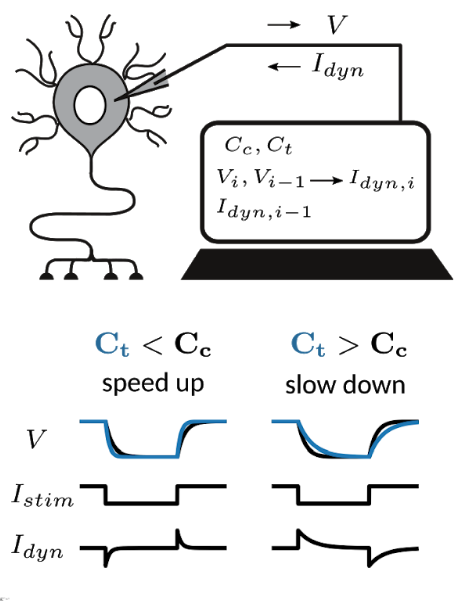

# dynamic_clamp_workshop
Workshop on the dynamic clamp technique for the Berlin-Oxford Phd meeting 28-29th of March 2019

## program

### 15:00 - 15:10 Closing the theo-exp loop
* are you **T** or **E**?
* collect expertise on the board

### 15:00 - 15:25 Dynamic clamp 101

### 15:25 - 15:50 Discussion: Applications of the dynamic clamp
* [Fluctuating synaptic conductances recreate in vivo-like activity in neocortical neurons](http://www.sciencedirect.com/science/article/pii/S030645220100344X)
* [Membrane potential resonance frequency influences network frequency through electrical coupling](https://www.physiology.org/doi/pdf/10.1152/jn.00361.2016)
* [Automatic adaptation of model neurons and connections to build hybrid circuits with living networks](https://www.biorxiv.org/content/10.1101/419622v1.abstract)
* [Towards a Dynamic Clamp for Neurochemical Modalities](https://www.mdpi.com/1424-8220/15/5/10465)
]
* [Sodium Along With Low-Threshold Potassium Currents Enhance Coincidence Detection of Subthreshold Noisy Signals in MSO Neurons](https://www.physiology.org/doi/full/10.1152/jn.00717.2003)
* [Connecting Neurons to a Mobile Robot: An In Vitro Bidirectional Neural Interface](https://www.hindawi.com/journals/cin/2007/012725/abs/
* [A Dynamic Role for GABA Receptors on the Firing Pattern of Midbrain Dopaminergic Neurons](https://www.physiology.org/doi/full/10.1152/jn.00204.2010)
* [Reliable neuromodulation from circuits with variable underlying structure](https://www.pnas.org/content/106/28/11742.short)
* [Well-Timed, Brief Inhibition Can Promote Spiking: Postinhibitory Facilitation](https://www.physiology.org/doi/full/10.1152/jn.00752.2005)
* [Generalization of the Dynamic Clamp Concept in Neurophysiology and Behavior](https://journals.plos.org/plosone/article?id=10.1371/journal.pone.0040887)
* [The central pattern generator underlying swimming in Dendronotus iris: a simple half-center network oscillator with a twist](https://www.physiology.org/doi/full/10.1152/jn.00150.2016)
* [Ionic Current Correlations Underlie the Global Tuning of Large Numbers of Neuronal Activity Attributes](http://www.jneurosci.org/content/32/39/13380?utm_source=TrendMD&utm_medium=cpc&utm_campaign=JNeurosci_TrendMD_0)
* [Impact of Heterogeneous Perisomatic IPSC Populations on Pyramidal Cell Firing Rates](https://www.physiology.org/doi/full/10.1152/jn.00916.2003)
* [Direct measurement of somatic voltage clamp errors in central neurons](https://www.nature.com/articles/nn.2137)

### 15:50 - 16:05 Speed up and slow down neurons with the capacitance clamp 

* chalk talk: how to clamp a neuron's capacitance
* demonstration of the capacitance clamp in [RELACS](http://relacs.sourceforge.net/index.html)

### 16:05 - 16:30 Brainstorming: Loops beyond the dynamic clamp
* pair up theory and experimental backgrounds
* brainstorm on possible closed loops between soft- and wetware (15 mins)
* short presentations (10 mins)
